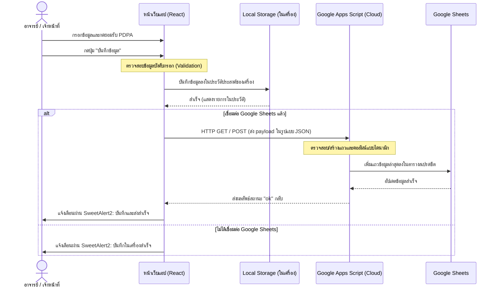

# เอกสารอธิบายโครงสร้างและการทำงานโปรเจค OAA โปรแกรมบันทึกอาจารย์พิเศษ
*(Adjunct Instructor Information System · Sripatum University)*

ระบบนี้เป็นเว็บแอปพลิเคชันที่พัฒนาขึ้นเพื่อใช้สำหรับ **บันทึกข้อมูล คัดกรอง และตรวจสอบคุณสมบัติของอาจารย์พิเศษ (Adjunct Instructors)** ของมหาวิทยาลัยศรีปทุม (SPU) ตามเกณฑ์มาตรฐานหลักสูตรระดับอุดมศึกษา พ.ศ. 2565 

---

## 🛠️ เทคโนโลยีและสถาปัตยกรรม (Tech Stack & Architecture)

ระบบถูกออกแบบมาให้เป็น **Serverless / Single-Page Application (SPA)** ที่ทำงานในฝั่งไคลเอนต์และจัดเก็บข้อมูลออนไลน์ผ่านระบบคลาวด์ของ Google:

1. **Frontend (React - Client-side Rendering):**
   - พัฒนาด้วยเฟรมเวิร์ก **React (v18.3.1)** และ **React DOM**
   - รันในเบราว์เซอร์โดยตรงโดยใช้ **Babel Standalone (v7.29.0)** ในการแปลงโค้ด JSX (ไม่จำเป็นต้องมีขั้นตอนการ Build ด้วย Node.js ทำให้เปิดใช้งานแบบออฟไลน์ได้สะดวก)
   - ใช้ **SweetAlert2** สำหรับแสดงกล่องโต้ตอบการแจ้งเตือนและระบบ Login ป้องกันความปลอดภัย
   - สไตล์ลิ่งผ่าน **Vanilla CSS** และ **React Inline Styles**
   
2. **Storage & Integration (ฐานข้อมูลและการบันทึก):**
   - **Local Storage:** บันทึกข้อมูลร่างแบบฟอร์มและประวัติบันทึกแบบออฟไลน์บนเบราว์เซอร์ของผู้ใช้ทันทีเพื่อป้องกันข้อมูลสูญหาย (`oaa_form_data_v1`)
   - **Google Sheets (ผ่าน Google Apps Script):** ส่งและบันทึกข้อมูลเข้าตารางสเปรดชีตหลักแบบเรียลไทม์ โดยใช้ Apps Script เป็น Web App API รับส่งข้อมูลผ่าน HTTP GET/POST

3. **Print System (การพิมพ์รายงาน):**
   - หน้าแสดงผลพรีวิวใบสมัครที่จัดหน้าตามอัตราส่วนหน้ากระดาษ **A4 (Portrait)** เพื่อการบันทึกหรือพิมพ์เป็น PDF ที่สวยงามและเป็นระเบียบ

---

## 📁 โครงสร้างไฟล์ในโปรเจค (File Architecture)

โปรเจคประกอบด้วยไฟล์หลักและไดเรกทอรีดังนี้:

* **[index.html](file:///c:/Users/mmath/.gemini/antigravity-ide/scratch/OAA โปรแกรมบันทึกอาจารย์พิเศษ/index.html):** หน้าหลักของแอปพลิเคชัน โหลดไลบรารีผ่าน CDN และเตรียม Element `#root` และหน้าจอ Loading Screen พร้อมการคำนวณ Progress bar แบบหลอกตาเพื่อความลื่นไหลในการโหลด
* **[components.jsx](file:///c:/Users/mmath/.gemini/antigravity-ide/scratch/OAA โปรแกรมบันทึกอาจารย์พิเศษ/components.jsx):** ไลบรารีส่วนประกอบ UI ที่ใช้ร่วมกันในแอปพลิเคชัน (Shared UI components) เช่น:
  - `SectionHeader`: หัวข้อแบ่งแต่ละส่วน
  - `SearchableDropdown`: กล่องตัวเลือกแบบค้นหาชื่อวิชาหรือสถาบันได้
  - `TextInput`, `SelectInput`, `DateInput`: ฟิลด์กรอกข้อมูลรูปแบบต่างๆ
  - `Card`, `SubCard`: การ์ดกรอบข้อมูล (SubCard ใช้สำหรับข้อมูลที่มีการทำซ้ำ เช่น ประสบการณ์)
* **[app.jsx](file:///c:/Users/mmath/.gemini/antigravity-ide/scratch/OAA โปรแกรมบันทึกอาจารย์พิเศษ/app.jsx):** หัวใจหลักของแอปพลิเคชัน ควบคุม State, การคำนวณคุณสมบัติ, ตรรกะฟอร์มทั้งหมด 8 ส่วน และระบบ Admin รวมถึงฟังก์ชันจัดการบันทึกข้อมูล
* **[data.js](file:///c:/Users/mmath/.gemini/antigravity-ide/scratch/OAA โปรแกรมบันทึกอาจารย์พิเศษ/data.js):** ฐานข้อมูลดิบ (Master Data) สำหรับตัวเลือกดรอปดาวน์ต่างๆ เช่น รายชื่อภาคการศึกษา คณะ/สาขา รายชื่อหลักสูตร มหาวิทยาลัย และรหัสวิชาของ SPU
* **[index-print.html](file:///c:/Users/mmath/.gemini/antigravity-ide/scratch/OAA โปรแกรมบันทึกอาจารย์พิเศษ/index-print.html):** เทมเพลตสำหรับแสดงผลหน้าพรีวิวพร้อมสไตล์ CSS สำหรับการสั่งพิมพ์ (Print-friendly CSS) ซึ่งรองรับการดึงข้อมูลจาก `localStorage` มาแสดงรายบุคคล
* **[google-apps-script/code.gs](file:///c:/Users/mmath/.gemini/antigravity-ide/scratch/OAA โปรแกรมบันทึกอาจารย์พิเศษ/google-apps-script/code.gs):** โค้ดสำหรับฝั่ง Google Apps Script ทำหน้าที่รับข้อมูลผ่าน `doGet(e)` / `doPost(e)` จากหน้าเว็บเพื่อนำไปเพิ่มแถวใหม่ใน Google Sheets โดยมีตรรกะสร้างคอลัมน์อัตโนมัติหากมีวิชาหรือสถาบันใหม่ถูกเพิ่มเข้ามา
* **[บันทึกข้อมูลอาจารย์พิเศษ (Standalone).html](file:///c:/Users/mmath/.gemini/antigravity-ide/scratch/OAA โปรแกรมบันทึกอาจารย์พิเศษ/บันทึกข้อมูลอาจารย์พิเศษ (Standalone).html):** ไฟล์เวอร์ชัน Bundled ที่รวมทั้ง HTML, CSS, JavaScript (data, components, app) ไว้ในไฟล์เดียวเพื่อให้ผู้ใช้สามารถนำไปเปิดรันออฟไลน์ได้โดยไม่ต้องเชื่อมต่ออินเทอร์เน็ต (ยกเว้นระบบคลาวด์)

---

## ⚙️ ส่วนของฟอร์มข้อมูลทั้ง 8 ส่วน (Form Sections)

ในหน้าเว็บแอปจะแบ่งการบันทึกข้อมูลออกเป็น 8 ส่วนหลัก โดยมีการคำนวณและตรวจสอบเงื่อนไขแบบไดนามิก ดังนี้:

### 1. ข้อมูลภาคการศึกษาและคณะ/สาขาวิชา ([Section1](file:///c:/Users/mmath/.gemini/antigravity-ide/scratch/OAA โปรแกรมบันทึกอาจารย์พิเศษ/app.jsx#L560-L587))
ระบุภาคการศึกษาและ คณะ/สาขา ที่อาจารย์เข้ามาสอน โดยมีการดึงข้อมูลมาจาก `FACULTY_BRANCH`

### 2. ข้อมูลส่วนตัว ([Section2](file:///c:/Users/mmath/.gemini/antigravity-ide/scratch/OAA โปรแกรมบันทึกอาจารย์พิเศษ/app.jsx#L590-L630))
คำนำหน้าชื่อ (รองรับการกรอกเองในกรณีเป็นอื่นๆ), ชื่อ-นามสกุล ทั้งภาษาไทยและอังกฤษ รวมทั้งช่องทางการติดต่อ (เบอร์โทร, อีเมล)

### 3. วุฒิการศึกษา ([Section3](file:///c:/Users/mmath/.gemini/antigravity-ide/scratch/OAA โปรแกรมบันทึกอาจารย์พิเศษ/app.jsx#L633-L718))
ระบุประวัติการศึกษาโดยระบบจะแสดงกล่องระบุสูงสุดตามเงื่อนไข:
- หากวุฒิสูงสุดเป็น **ปริญญาโท**: ระบบจะเพิ่มช่องกรอก **ปริญญาตรี** อัตโนมัติ (รวมเป็น 2 วุฒิ) และตั้งค่าคุณสมบัติกลุ่มที่ 1 ให้โดยอัตโนมัติ
- หากวุฒิสูงสุดเป็น **ปริญญาเอก**: ระบบจะเพิ่มช่องกรอก **ปริญญาโท** และ **ปริญญาตรี** อัตโนมัติ (รวมเป็น 3 วุฒิ)
- ค้นหาหลักสูตรและสถาบันผ่าน `SearchableDropdown`

### 4. ประสบการณ์การทำงาน ([Section4](file:///c:/Users/mmath/.gemini/antigravity-ide/scratch/OAA โปรแกรมบันทึกอาจารย์พิเศษ/app.jsx#L721-L788))
ระบุบริษัท/หน่วยงานที่เคยร่วมงาน วันเริ่มต้น-สิ้นสุด โดยมีตรรกะเสริม:
- หากเลือกสถานะเป็น **ปัจจุบัน**: ระบบจะซ่อนวันที่สิ้นสุดงานและคำนวณอายุงานจนถึงวันปัจจุบันให้ทันที
- คำนวณระยะเวลารวมในแต่ละงานอิงตามจำนวนเดือน
- มีตัวเลือก **"ประสบการณ์ตรง"** ในกรณีที่วุฒิสูงสุดคือ ปริญญาตรี เพื่อนำไปใช้นับอายุงานคุณสมบัติของกลุ่มที่ 2

### 5. คุณสมบัติของอาจารย์พิเศษ ([Section5](file:///c:/Users/mmath/.gemini/antigravity-ide/scratch/OAA โปรแกรมบันทึกอาจารย์พิเศษ/app.jsx#L791-L916))
เป็นระบบคัดกรองอัตโนมัติตามเกณฑ์ปี 2565 แบ่งออกเป็น 3 กลุ่ม:
* **กลุ่มที่ 1: คุณวุฒิปริญญาโท หรือ มีตำแหน่งทางวิชาการ**
  - ผลลัพธ์: **อาจารย์พิเศษ**
  - เงื่อนไข: มีวุฒิปริญญาโทตรงสาย หรือ ดำรงตำแหน่ง ศ./รศ./ผศ. ในสาขาวิชานั้นๆ
* **กลุ่มที่ 2: คุณวุฒิปริญญาตรี + ประสบการณ์ตรง 5 ปีขึ้นไป**
  - ผลลัพธ์: **อาจารย์พิเศษร่วมสอน**
  - เงื่อนไข: วุฒิ ป.ตรี และเมื่อนำอายุงานในประสบการณ์ทั้งหมดที่เลือก "ประสบการณ์ตรง" มารวมกันแล้วต้องไม่น้อยกว่า 5 ปีขึ้นไป
* **กลุ่มที่ 3: คุณวุฒิปริญญาตรี + ประสบการณ์ตรงน้อยกว่า 5 ปี**
  - ผลลัพธ์: **อาจารย์พิเศษช่วยสอน**
  - เงื่อนไข: วุฒิ ป.ตรี แต่อายุงานรวมของประสบการณ์ตรงน้อยกว่า 5 ปี

### 6. รายวิชาที่สอน ([Section6](file:///c:/Users/mmath/.gemini/antigravity-ide/scratch/OAA โปรแกรมบันทึกอาจารย์พิเศษ/app.jsx#L919-L985))
ช่องค้นหาและเพิ่มรายวิชาที่สอน ระบุระดับบัณฑิตของวิชานั้น หน่วยกิต และจำนวนครั้งที่สอน

### 7. สัดส่วนการสอน ([Section7](file:///c:/Users/mmath/.gemini/antigravity-ide/scratch/OAA โปรแกรมบันทึกอาจารย์พิเศษ/app.jsx#L988-L1035))
คำนวณสัดส่วนการสอนโดยอัตโนมัติอิงจากรหัสวิชา:
- รหัสวิชาที่ตรงตามเงื่อนไขบางกลุ่มจะถูกระบุเป็น `50%` หรือ `ไม่มีกำหนด`
- สามารถกรอกชั่วโมงสอนต่อสัปดาห์และหมายเหตุเพิ่มเติมได้

### 8. ความเชี่ยวชาญ หมายเหตุ และ PDPA ([Section8](file:///c:/Users/mmath/.gemini/antigravity-ide/scratch/OAA โปรแกรมบันทึกอาจารย์พิเศษ/app.jsx#L1038-L1066))
ระบุฟิลด์ความเชี่ยวชาญเพิ่มเติม และต้องกดยอมรับความยินยอมข้อมูลส่วนบุคคล (PDPA Consent Checkbox) ก่อนที่จะสามารถบันทึกฟอร์มได้

---

## 🔐 ระบบ Admin Mode & Settings

หน้าเว็บมีฟังก์ชันปุ่ม **🔐 Admin** บริเวณมุมขวาบนของ Header:
- เมื่อคลิกจะเรียก `handleAdminLogin()` เพื่อรับรหัสผ่าน
- รหัสผ่านเข้าสู่ระบบเริ่มต้นคือ **`123456`** (ฮาร์ดโค้ดใน [app.jsx:1263](file:///c:/Users/mmath/.gemini/antigravity-ide/scratch/OAA โปรแกรมบันทึกอาจารย์พิเศษ/app.jsx#L1263))
- เมื่อเข้าสู่โหมด Admin สำเร็จ ปุ่มจะเปลี่ยนเป็น **⚙️ ตั้งค่า Sheets** เพื่อให้ระบุ Google Apps Script Web App URL สำหรับใช้จัดเก็บข้อมูลออนไลน์

---

## 🔄 ลำดับการบันทึกและการส่งข้อมูล (Data Flow)

---

## 📋 ขั้นตอนการ Deploy Google Apps Script

ในฝั่งผู้ดูแลระบบ หากต้องการให้ข้อมูลลิงก์เข้า Google Sheets ตลอดเวลา ให้ดำเนินการตามขั้นตอนนี้:

1. เปิดเบราว์เซอร์แล้วสร้าง **Google Sheets** เปล่าขึ้นมาใหม่
2. ไปที่เมนู **ส่วนขยาย (Extensions)** -> **Apps Script**
3. คัดลอกโค้ดทั้งหมดในไฟล์ [google-apps-script/code.gs](file:///c:/Users/mmath/.gemini/antigravity-ide/scratch/OAA โปรแกรมบันทึกอาจารย์พิเศษ/google-apps-script/code.gs) ไปวางทดแทนของเดิมในช่องเขียนโค้ดและกดบันทึก
4. คลิกปุ่ม **การทำให้ใช้งานได้ (Deploy)** -> **การทำให้ใช้งานได้ใหม่ (New deployment)**
5. เลือกประเภทการทำงานเป็น **เว็บแอป (Web app)**
   - **เรียกใช้งานในฐานะ (Execute as):** ฉัน (Me - อีเมลโฮสต์สเปรดชีต)
   - **ผู้มีสิทธิ์เข้าถึง (Who has access):** ทุกคน (Anyone)
6. คลิก **การทำให้ใช้งานได้ (Deploy)** จากนั้นคัดลอก **URL ของเว็บแอป (Web app URL)**
7. นำ URL นั้นมากรอกในส่วนตั้งค่า Admin Mode บนหน้าแอปพลิเคชัน OAA
